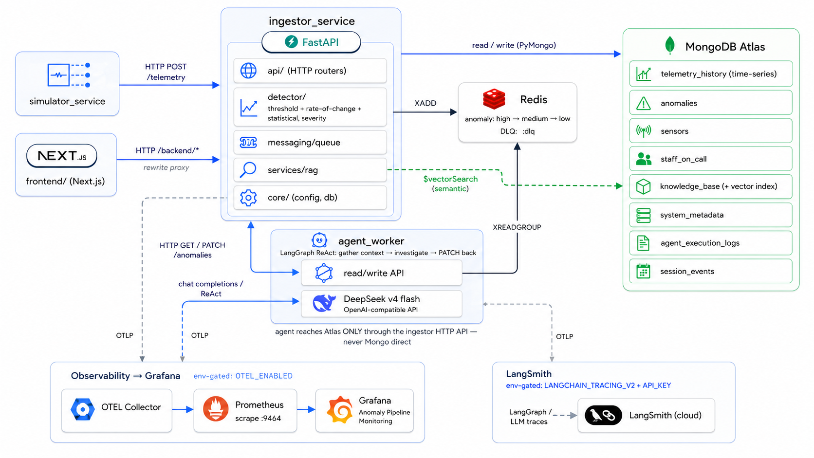
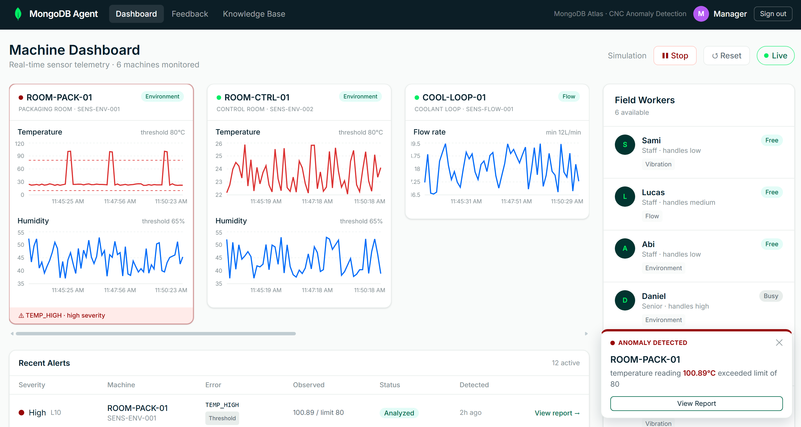
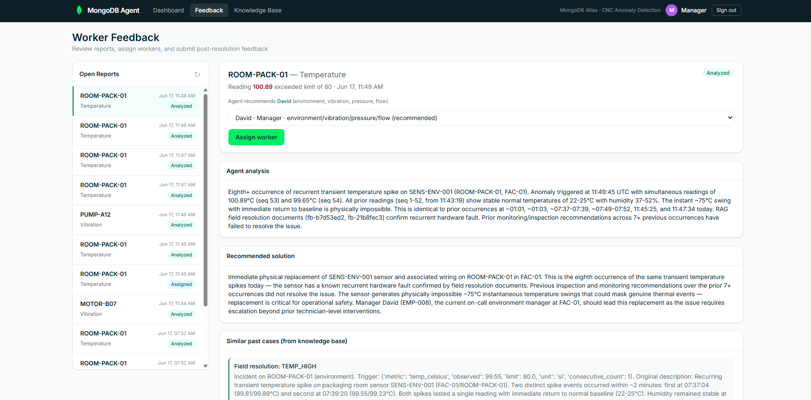
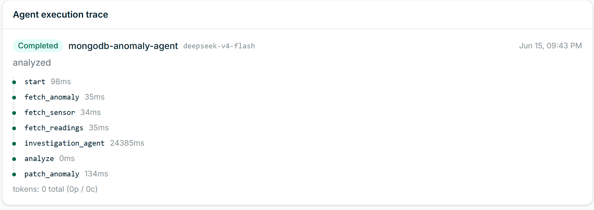

# MongoDB Atlas Anomaly Detection Platform

An **event-driven, multi-service platform** that watches industrial / CNC
machinery in real time, automatically catches when a machine starts misbehaving,
and uses an **AI reasoning agent** to investigate each problem, recommend a fix,
and route it to the right on-call engineer.

Telemetry streams into a **FastAPI** data layer backed by **MongoDB Atlas**
(system of record **and** vector search). A configurable detector flags anomalies
and hands each to a **LangGraph** agent powered by **DeepSeek**, which reasons
over a **retrieval-augmented (RAG)** knowledge base of past incidents. A
**Next.js** operator dashboard drives the whole pipeline, and every resolved
incident feeds back into the knowledge base — so the system gets smarter over time.

> **Core design rule:** every part integrates over the **HTTP API** — no service
> reaches into another's database or imports its internals. Detection, AI
> reasoning, the simulator, and the UI stay cleanly decoupled.



---

## Features

- **Real-time detection** — a three-detector pipeline (threshold +
  rate-of-change + statistical) with automatic severity scoring.
- **AI investigation agent** — a LangGraph ReAct agent (DeepSeek) explains each
  anomaly, recommends a fix, and names the engineer to call.
- **Semantic RAG** — MongoDB Atlas Vector Search (Automated Embedding, Voyage
  AI) grounds the agent in relevant past incidents.
- **Closed feedback loop** — resolved incidents flow back into the knowledge
  base (after human curation) to improve future investigations.
- **Severity-routed queue** — Redis Streams dispatch anomalies by priority with
  retries and a dead-letter queue.
- **Operator dashboard** — Next.js console for live charts, alerts, agent
  reports, assignment, and Start/Stop/Reset controls.
- **Optional observability** — env-gated OpenTelemetry → Prometheus → Grafana,
  plus LangSmith agent tracing.

---

## How it works

Five services around two data stores (**MongoDB Atlas** + **Redis**), each its own
process, talking only over HTTP (or, for the agent, the Redis job stream):

| Part | What it is | Run |
|------|------------|-----|
| `ingestor_service` | FastAPI **data layer** + HTTP API + detector | `uvicorn ingestor_service.app:app --port 8000` |
| `agent_worker` | LangGraph **reasoning agent** (consumes Redis jobs) | `python -m agent_worker.main` |
| `simulator_service` | Telemetry / fault **generator** | `python -m simulator_service.main` |
| `frontend/` | Next.js **operator dashboard** | `cd frontend && npm run dev` |
| `monitoring/` | Optional OTEL → Prometheus → Grafana | `docker compose -f monitoring/docker-compose.observability.yml up` |

```
simulator → ingestor → detector → (Redis queue) → agent_worker → writes analysis back → dashboard
```

---

## Getting Started

### Prerequisites

- [Python 3.11+](https://www.python.org/) (3.11 or 3.12)
- [Node.js 18+](https://nodejs.org/) + npm (frontend)
- [Docker](https://www.docker.com/) (easiest way to run Redis) or a local Redis
- A [MongoDB Atlas](https://www.mongodb.com/atlas) cluster with **Vector Search /
  Automated Embedding (Voyage AI)** (M0 / Flex and dedicated tiers)
- A [DeepSeek](https://platform.deepseek.com/api_keys) API key (the agent falls
  back to a deterministic decision if absent)

### 1. Clone and configure

```bash
git clone https://github.com/IE-AI-Lab/MongoDB_Anomaly
cd MongoDB_Anomaly
cp .env.example .env        # then fill in the values below
pip install -r requirements.txt
```

Key `.env` values:

```bash
MONGO_URI="mongodb+srv://<user>:<password>@<cluster>.mongodb.net/"
DB_NAME="anomaly_db"
VOYAGE_EMBED_MODEL=voyage-4-lite          # must match the Atlas index model (step 2)

# Chat / agent reasoning — DeepSeek (OpenAI-compatible API)
LLM_BASE_URL=https://api.deepseek.com
LLM_API_KEY=<your DeepSeek key>
CHAT_MODEL=deepseek-v4-flash

AGENT_DISPATCH=redis                       # "stub" logs to stdout instead
REDIS_URL=redis://127.0.0.1:6379/0
```

> `.env` is gitignored — **never commit real keys.** The agent uses
> `langchain_openai.ChatOpenAI` only as the generic client for the OpenAI
> chat-completions **wire format** (a de-facto standard) — pointed at
> `LLM_BASE_URL`, every request goes to **DeepSeek**, never OpenAI. Details in
> [docs/REFERENCE.md](docs/REFERENCE.md#llm-provider-chat--agent-reasoning).

### 2. Initialize the database

Seed collections, indexes, thresholds, staff, sensors, and the knowledge corpus
(idempotent):

```bash
python -m scripts.init_db
```

Then create the Atlas Vector Search index **once, manually** — without it,
knowledge search falls back to a recency sort. In the Atlas UI: **Atlas Search →
Create Search Index → Vector Search → JSON editor**, on `knowledge_base`, named
`knowledge_vector`:

```json
{
  "fields": [
    { "type": "autoEmbed", "modality": "text", "path": "text_content", "model": "voyage-4-lite" },
    { "type": "filter", "path": "equipment_type" },
    { "type": "filter", "path": "associated_error_codes" },
    { "type": "filter", "path": "is_active" }
  ]
}
```

Wait ~1 min for status `Active`. The `model` must equal `VOYAGE_EMBED_MODEL`.

### 3. Run the stack

Redis must be reachable on `REDIS_URL` (e.g. `docker run -d -p 6379:6379 redis`).

**One command** — API (`:8000`) + agent + simulator + frontend (`:3000`); Ctrl+C
stops everything:

```bash
pip install -r requirements.txt -r requirements-dev.txt

# Windows:        powershell -ExecutionPolicy Bypass -File scripts\dev_up.ps1
# macOS / Linux:  ./scripts/dev_up.sh        # wraps `honcho start`
```

**Or separate terminals:**

```bash
uvicorn ingestor_service.app:app --reload --host 0.0.0.0 --port 8000   # API
python -m agent_worker.main                                            # agent worker
python -m simulator_service.main --base-url http://127.0.0.1:8000 --deterministic-demo   # one anomaly ~every 2 min
cd frontend && npm install && npm run dev                              # dashboard
```

Open the dashboard at **http://localhost:3000** and interactive API docs at
**http://localhost:8000/docs**.

> **Ports:** Next dev and the optional Grafana stack both default to **3000** — run
> the frontend elsewhere (`npm run dev -- -p 3001`) if you run monitoring too.
> **Windows:** use `127.0.0.1`, not `localhost`, for `DATA_LAYER_BASE_URL`.

### Tests

```bash
pip install -r requirements.txt -r requirements-dev.txt
pytest                  # pure-logic unit tests; no DB or API keys needed
pytest tests/evals/     # CI-safe RAG + agent-output evals
```

CI (GitHub Actions) runs `pytest` on every push to `main` and every PR (Python
3.11 + 3.12).

---

## Architecture & benefits

Telemetry events flow through decoupled services that each do one job,
communicating over HTTP and a Redis job stream — so detection, AI reasoning, and
the UI scale and fail independently.

**Core components:**

- **`ingestor_service`** — receives telemetry, runs the detector, persists to
  Mongo, and exposes the HTTP API everything else builds on.
- **`agent_worker`** — pulls anomaly jobs from Redis and investigates them with a
  ReAct agent, calling back into the API for context before writing its analysis.
- **`simulator_service`** — generates realistic telemetry + injectable faults so
  the whole pipeline runs without real hardware.
- **MongoDB Atlas** — system of record **and** vector-search engine (auto-embeds
  the knowledge base, so the app never manages vectors).
- **Redis** — the at-least-once, severity-routed job stream with retries + DLQ.
- **`frontend/`** — the operator's window: live charts, alerts, reports,
  assignment, simulation controls.

**Data flow:** simulator emits telemetry → ingestor detects an anomaly and queues
it by severity → agent investigates (RAG + sensor/staff context) and PATCHes the
analysis back → a manager assigns it, an engineer resolves it → a `fixed`
resolution feeds the knowledge base (after curation), **closing the loop**.

**Benefits:**  real-time (the ingestor never blocks on the agent) ·  the agent
explains *and* routes, grounded in real cases ·  gets smarter via the curated
feedback loop ·  decoupled + resilient (retrying, dead-lettering queue) · 
observable (OTEL metrics + LangSmith traces).

---

## Monitoring (optional)

Env-gated OpenTelemetry → OTEL Collector → Prometheus → Grafana:

```bash
pip install -r requirements.txt -r requirements-observability.txt
docker compose -f monitoring/docker-compose.observability.yml up
# in .env: OTEL_ENABLED=true and OTEL_EXPORTER_OTLP_ENDPOINT=http://localhost:4317
```

Run the stack, then open Grafana at http://localhost:3000 (`admin`/`admin`) and
the **Anomaly Pipeline Monitoring** dashboard (ingest rate, anomalies created,
agent p95 latency/failures, per-route requests, Redis queues by severity). Reset
counters before a run with `./scripts/reset_redis_queues.sh` or
`curl -X POST http://localhost:8000/simulation/reset`.

---

## Documentation

- **[docs/REFERENCE.md](docs/REFERENCE.md)** — anomaly detection, agent internals,
  full **HTTP API**, telemetry contract, collections, RAG, LLM provider, evals,
  LangSmith, module map, and gotchas.
- **`http://localhost:8000/docs`** — live, interactive OpenAPI docs.
- **[frontend/README.md](frontend/README.md)** — dashboard page/route map.
- **[docs/AGENT_INTEGRATION_GUIDE.md](docs/AGENT_INTEGRATION_GUIDE.md)** — integrating
  an external agent over the API.

---

## Status & roadmap

**Live end-to-end:** DB setup; telemetry ingest; the three-detector pipeline with
severity + debounce; hybrid RAG (vector + keyword) with the closed feedback loop;
the full read/write/admin HTTP API; the severity-routed Redis queue with retry +
DLQ; the LangGraph agent worker (DeepSeek, with deterministic fallback); the
Next.js dashboard; and the optional OTEL → Prometheus → Grafana stack.

**Roadmap (non-blocking):** a WebSocket `/ws` + Redis-pub/sub EventBus to replace
polling; a stateless `POST /chat`; email alerts on creation/`analyzed`; and real
auth (the dashboard currently has none).

---

## Screenshots:

**Dashboard** — live machine telemetry, field workers, recent alerts, and a
new-anomaly toast:



**Feedback** — review the agent's analysis, then assign an on-call worker:



**Knowledge Base** — the RAG corpus the agent retrieves from; field resolutions
land here pending review:


